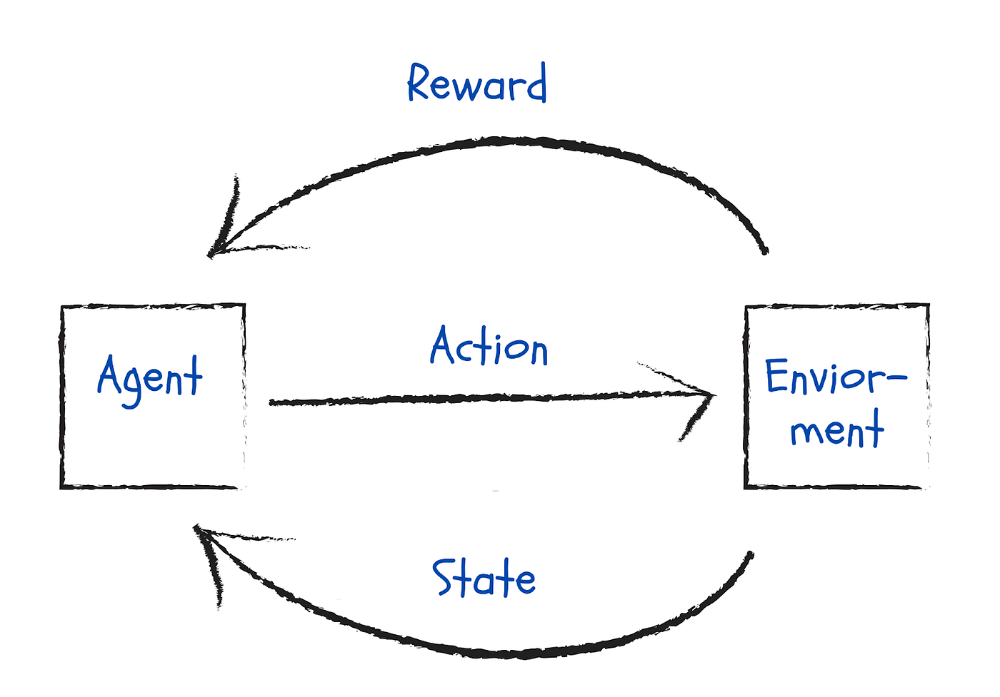
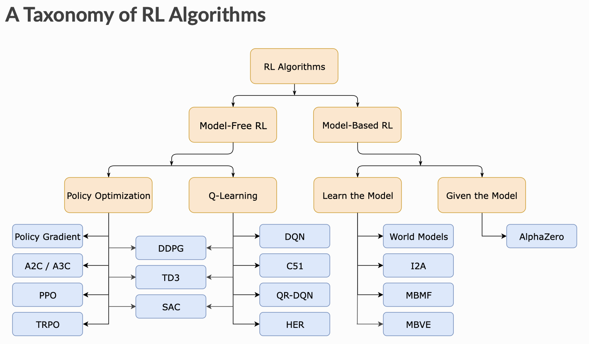
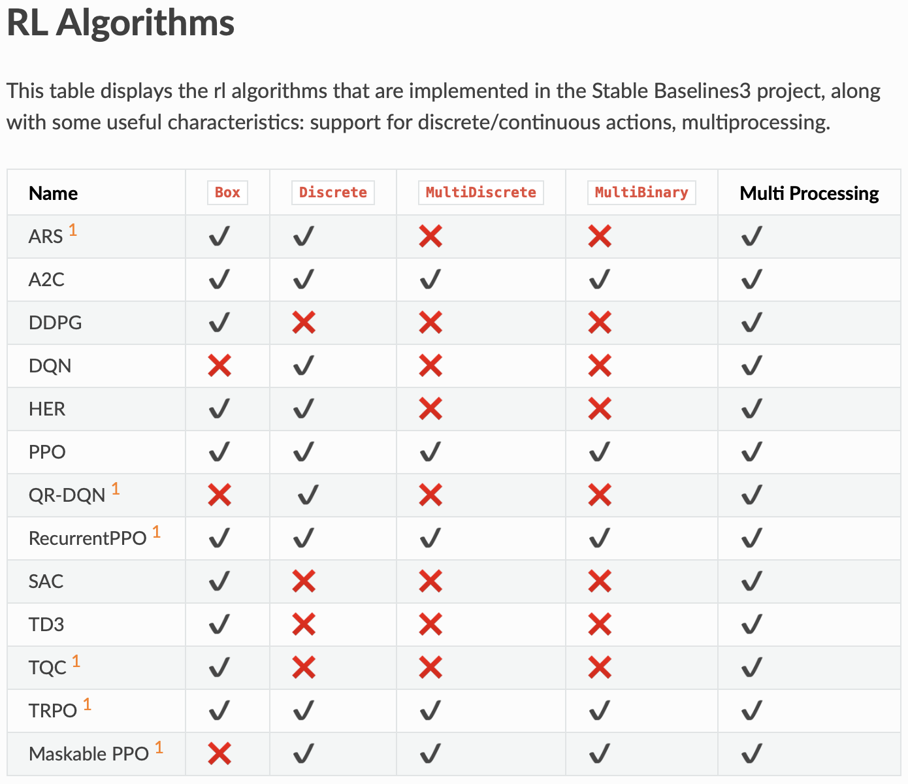

# Reinforcement Learning

## RL in a Nutshell

Reinforcement Learning focuses on teaching agents through trial and error.  

### Concepts



There are 4 fundamental concepts that underpin most RL projects. These are:  
**Agent**:  The actor operating within the environment. It is usually governed by a policy (a rule that decides what action to take)  
**Environment**:  The world in which the agent can operate in.  
**Action**:  The agent can do something within the environment known as an action.  
**Reward and Observations**:  In return the agent recieves a reward and a view of what the environment looks like after acting on it.    

_The agent tries to take an action that maximizes the reward based on the observations it makes in the environment._   

### Applications of RL

There are a range of applications for Reinforcement learning. Including:
- Autonomous Driving
- Securities Trading
- Neural Network Architecture Search
- Simulated Training of Robots
- Gaming

### Limitations and Considerations

- For simple problems RL can be overkill
- Assumes the environment is Markovian
- Training can take a long time and is not always stable

## 1. Setup

### Install Required Dependencies

```bash
# Stable Baselines Install
!pip install stable-baselines3[extra]
```
RL library that allows to work with model-free algorithms

**Documentation**: https://stable-baselines3.readthedocs.io/en/master/guide/migrations.html

Stable Baselines is a python library that makes it easier to get up and running with Reinforcement Learning. It is originally based off of the OpenAI Baselines. Run on tensorflow and pytorch.

## 2. Environments

### Simulated vs Real Environments

Environments can either be real or simulated. Simulated environments give you the ability to trial and train a model in a safe and cost effective manner.
This is why we are using OpenAI Gym. OpenAI Gym provides you with an easy way to build environments for training RL agents.

**Documentation**: https://gym.openai.com/docs/  
Gym is a toolkit for developing and comparing reinforcement learning algorithms. It supports teaching agents everything from walking to playing games like Pong or Pinball

### OpenAI Gym Spaces

This gives you a kicking off point rather than having to write all of the code yourself.   
- **Box** - n dimensional tensor, range of values.  
E.g. ```Box(0,1,shape=(3,3))```
- **Discrete** - set of items  
E.g. ```Discrete(3)```
- **Tuple** - tuple of other spaces e.g. Box or Discrete  
E.g. ```Tuple((Discrete(2), Box(0,100,shape=(1,))))```
- **Dict** - dictionary of spaces e.g. Box or Discrete  
E.g. ```Dict({'height': Discrete(2), "speed": Box(0,100,shape=(1,))})```
- **MultiBinary** - one hot encoded binary values  
E.g. ```MultiBinary(4)```
- **MultiDiscrete** - multiple discrete values  
E.g. ```MultiDiscrete([5,2,2])```

The Environment contains both observation space and the action space.

## 3. Training

### Types of Algorithm

Model vs Model-Free: Learning based on predictions of next state/reward or real samples.   
Stable baselines focuses on Model-Free Algorithms.


__Source__: https://spinningup.openai.com/en/latest/

**Model-Free vs Model-Based**
One of the most important branching points in an RL algorithm is the question of **whether the agent has access to (or learns) a model of the environment**. By a model of the environment, we mean a function which predicts state transitions and rewards.   
The main upside to having a model is that **it allows the agent to plan** by thinking ahead, seeing what would happen for a range of possible choices, and explicitly deciding between its options.   
The main downside is that **a ground-truth model of the environment is usually not available to the agent**.   
Algorithms which use a model are called **model-based** methods, and those that don’t are called **model-free**.

### Choosing Algorithms

There are a number of algorithms available through Stable Baselines. We can easily switch between them.   
Certain algorithms will perform better for certain environments.   

**Action Space**
Discrete Single Process: DQN
Discrete multi-processed: PPO or A2C
Continuous Single Process: SAC or TD3
Continuous Multi Processed: PPO or A2C



### Understanding Training Metrics

- **Evaluation Metrics**: ep_len_mean (episode length), ep_rew_mean (episode reward)
- **Time Metrics**: fps, iterations, time_elapsed, total_timesteps
- **Loss Metric**: entropy_loss, policy_loss, value_loss
- **Other Metrics**: explained variance, learning rate, n_updates

### Applying GPU Acceleration

**Does not garuntee in significant speed boosts.**    
To do so install Pytorch with cuda or ROCm.  
- Go to pytorch.org and hit install
- Go down and choose based on preferences.
- For CUDA you would require a Nvidia processor.

## 4. Testing and Evaluation

### Monitoring in Tensorboard

We can review evaluation, time and training metrics from within the Tensorboard. In order to do so you must specify a logging directory when you initialize your model.

model = PPO('MlpPolicy', env, verbose=1, **```tensorboard_log=log_path```**) 

```python
# Starting TensorBoard
!tensorboard --logdir=log_path
```

## 5. Callbacks, Alt Algorithms, Architectures

We can specify a reward threshold so the training stops once we reach this benchmark. This is to stop the training of the model to become more unstable.

### Applying Callbacks


**Import callback helpers**
```python
from stable_baselines3.common.callbacks import EvalCallback, StopTrainingOnRewardThreshold
```

**Setup Callbacks**
```python
stop_callback = StopTrainingOnRewardThreshold(reward_threshold=190, verbose=1)
eval_callback = EvalCallback(env, 
                             callback_on_new_best=stop_callback, 
                             eval_freq=10000, 
                             best_model_save_path=save_path, 
                             verbose=1)
```

**Apply callback to training step**
```python
model.learn(total_timesteps=20000, callback=eval_callback)
```

### Modifying Neural Network Architecture

We can change the underlying neural network which SB uses as part of policy.

**Define new MLP Network**
```python
net_arch=[dict(pi=[128, 128, 128, 128], vf=[128, 128, 128, 128])]
```

**Apply Network**
```python
model = PPO('MlpPolicy', env, verbose = 1, policy_kwargs={'net_arch': net_arch})
```

### Using different Algorithms

```python
from stable_baselines3 import DQN

model = DQN('MlpPolicy', env, verbose = 1, tensorboard_log=log_path)
```

## 6. Projects

### a. Breakout

### b. Self Driving

### c. Custom Environments